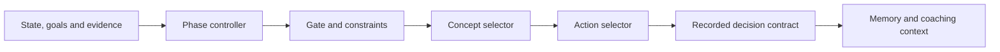

# Algorithms and learning decisions

[Back to README](../README.md#documentation) · [Architecture](architecture.md) · [MCP tools](mcp-tools.md)

Tutor combines explicit learning models with auditable selection rules. The
LLM supplies the conversation and generated content; the runtime owns model
updates, prerequisites, review timing and the evidence used for progress claims.

## Contents

- [Core models](#core-models)
- [Activity selection](#activity-selection)
- [Evidence and coaching](#evidence-and-coaching)
- [Narrative continuity](#narrative-continuity)
- [Limits and historical models](#limits-and-historical-models)

## Core models

| Model | Question it helps answer | Current behavior | Source |
|---|---|---|---|
| **Bayesian Knowledge Tracing (BKT)** | How does this response change the estimate of knowledge? | Computes a posterior using success/failure, slip and guess. Diagnostic, mastery and transfer probes update the observation only; practice/instruction activities retain a modeled learning opportunity. | [BKT](../algorithms/bkt.go), [update policy](../engine/bkt_policy.go) |
| **Individualized BKT** | Should recent learning history adjust the model parameters? | Applies bounded adjustments from recent observations. These remain heuristics requiring empirical calibration. | [Individualized BKT](../algorithms/individual_bkt.go) |
| **Information gain** | Which diagnostic concept could reduce uncertainty? | Uses expected reduction in the binary entropy of the knowledge estimate to help choose diagnostic activities. | [Information gain](../algorithms/bkt_info_gain.go) |
| **FSRS-5** | When should the learner review a concept? | Maintains stability, difficulty and retrievability with FSRS-5 equations. The scheduling adapter uses whole-day intervals. | [FSRS](../algorithms/fsrs.go) |
| **Knowledge Space Theory-inspired prerequisite graph (KST)** | What is accessible given the learner's current state? | Validates the graph and identifies concepts whose prerequisite conditions are satisfied. | [KST](../algorithms/kst.go) |
| **Threshold resolver** | Which thresholds should the pipeline use? | Centralizes the configured progression thresholds so components agree. | [Thresholds](../algorithms/thresholds.go) |

FSRS difficulty is a property of the review model; it is not used as an IRT
item parameter. Task-generation difficulty is a transparent heuristic, not a
calibrated probability of answering correctly.

## Activity selection

`get_next_activity` invokes the orchestrator with the learner's current state,
goal relevance, alerts and evidence. The main flow is:

| Component | Responsibility | Source |
|---|---|---|
| **Goal relevance** | The LLM decomposes the learner's goal into relevance weights; the engine uses them when ranking concepts. | [Goal tools](../tools/goal_relevance.go) |
| **Phase controller** | Chooses between diagnosis, instruction and maintenance using current observations. Review needs can stay within maintenance without restarting acquisition. | [Phase FSM](../engine/phase_fsm.go), [configuration](../engine/phase_config.go) |
| **Gate** | Applies constraints before selecting an activity, including session conditions and candidate eligibility. | [Gate](../engine/gate.go) |
| **Concept selector** | Balances diagnostic uncertainty, goal relevance, prerequisites and review urgency according to the phase. Diversity preferences can relax when they would block all available work. | [Concept selection](../engine/concept_selector.go) |
| **Action selector** | Chooses the kind of task: introduction, practice, recall, misconception work, explanation, mastery challenge or transfer probe. Supplies a generation difficulty target. | [Action selection](../engine/action_selector.go) |
| **Orchestrator** | Loads inputs, combines the pure decision functions, handles bounded fallback and persists the settled phase. | [Orchestrator](../engine/orchestrator.go) |
| **Decision contract** | Records the selected competency, curriculum/policy versions and constraints so an assessment can be bound to the actual decision. | [Activity handler](../tools/activity.go), [learning integrity](learning-integrity.md) |

## Evidence and coaching

| Component | Contribution | Source / guide |
|---|---|---|
| **Assessment validation** | Freezes tasks/rubrics before responses, validates every criterion and derives scores consistently in MCP and storage. | [Assessment contracts](../assessment/), [review](assessment-review.md) |
| **Mastery and retention evidence** | Keeps estimated knowledge, retained performance and demonstrated performance distinct. A high BKT estimate alone does not certify mastery. | [Mastery status](../engine/mastery_status.go), [evidence](../engine/evidence.go) |
| **Structured transfer** | Tracks evidence across near, far, debugging, teaching and creative probes. Transfer claims depend on eligible demonstration evidence. | [Transfer model](../engine/transfer_model.go) |
| **Uncertainty and Open Learner Model** | Exposes evidence coverage and the state behind progress views and recommendations. | [Uncertainty](../engine/uncertainty.go), [OLM](../engine/olm.go) |
| **Calibration** | Compares self-predictions with outcomes using absolute errors and visible sample coverage. Missing observations remain distinguishable from good calibration. | [Calibration policy](../engine/calibration_policy.go) |
| **Metacognition** | Produces descriptive observations, tutor-mode context and reflection intents from recorded behavior and affect. The LLM phrases the reflection. | [Metacognition](../engine/metacognition.go) |
| **Motivation** | Selects one relevant angle, such as a milestone or the practical value of a skill, and supplies signals for the LLM to express. | [Motivation](../engine/motivation.go) |
| **Alerts and nudges** | Identifies actionable learning conditions and plans delivery around consent, local availability and frequency limits. | [Alerts](../engine/alert.go), [nudge planner](../engine/nudge_planner.go) |
| **Audit and replay** | Preserves decision traces and reports missing rubrics, transfer gaps and replay coverage. | [Replay](../engine/replay.go), [audit tools](mcp-tools.md#audit--replay-3) |

High-stakes domains require trusted human-reviewed evidence for demonstrated
claims and intrusive suggestions. The runtime can verify configured external
attestations; it does not create an independent reviewer or certify a generated
task's semantic correctness. See [assessment certification](assessment-certification.md).

## Narrative continuity

The [memory layer](../memory/) selects relevant learner notes, recent sessions,
concept notes and archives for the next activity. Domain scoping prevents
similarly named concepts in unrelated subjects from sharing ambiguous context.
Consolidation requests ask the LLM to summarize longer periods; versioned storage
keeps the resulting narrative alongside the structured learning state.

Session records also preserve explicit next-step commitments. The scheduler
uses durable jobs and leases to coordinate background work, including when
multiple local clients share one profile. See [architecture](architecture.md).

## Limits and historical models

These models support inspectable decisions. Their software tests establish
implementation behavior, not measured learning effectiveness or psychometric
validation. Input quality still depends on the host recording and evaluating
the learner's responses faithfully. The [policy evaluation guide](learning-policy-evaluation.md)
describes how to assess outcomes using independent evidence.

- **PFA** has been removed from the runtime, including its plateau-alert producer.
- **IRT helpers** remain in [irt.go](../algorithms/irt.go), but historical theta
  is not updated or used to set task difficulty in the current runtime.
- **Automatic help withdrawal** from the composite autonomy score is disabled.
  `REGULATION_FADE` is a compatibility flag for descriptive output, not a validated
  policy for removing support.
- **Sub-day scheduling** remains deferred, despite FSRS-5's short-term equations.

The [current implementation notes](runtime-pedagogique-2026-09.md) (French)
document the corrections in detail and supersede the
[historical regulation designs](regulation-design/README.md).

The project draws on Corbett and Anderson's knowledge tracing, the
Open-Spaced-Repetition community's FSRS, and Falmagne and Doignon's work on
knowledge spaces. Interest-phase and complementary-learning-systems research
also informed the motivation and memory design; this is not a claim that the
complete Tutor system has been validated by those studies.
