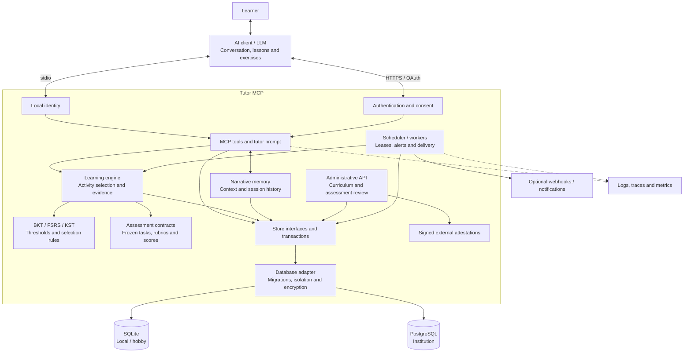

# Architecture

[Back to README](../README.md#documentation) · [Algorithms](algorithms.md) · [MCP tools](mcp-tools.md)

Tutor MCP is a Go runtime that gives an AI assistant persistent learning state,
activity recommendations and learner memory. The client supplies the LLM and the
conversation interface. Tutor does not host a language model or require a fixed
exercise bank: the assistant generates lessons and tasks for the current goal.

## Contents

- [System diagram](#system-diagram)
- [The two learning layers](#the-two-learning-layers)
- [A learning interaction](#a-learning-interaction)
- [Component map](#component-map)
- [Deployment profiles](#deployment-profiles)
- [Integrity and operations](#integrity-and-operations)

## System diagram

The same tools and teaching engine serve both transports. Remote authentication
resolves a learner principal; local startup creates a persistent learner identity.
Both then use the same authorization, transaction and idempotency boundaries.

## The two learning layers

| Layer | Contents | Responsibility |
|---|---|---|
| **Structured learning state** | Versioned concept graph, goals, interactions, mastery estimates, review dates, assessment and transfer evidence | The engine chooses a phase, concept and activity using explicit rules. Decision snapshots explain its inputs and outcome. |
| **Narrative memory** | Stable learner notes, pending observations, concept notes, session summaries and consolidated archives | The assistant records context that numeric state cannot express; the next activity includes relevant memory for the conversation. |

The assistant generates explanations, tasks, feedback and summaries. Tutor
stores their learning consequences and controls the progression rules. Narrative
text can inform coaching, but it cannot promote itself into trusted assessment
evidence or replace the engine's scheduling state.

All three explicit profiles store narrative objects as encrypted, versioned
database records. The legacy HTTP configuration can still use Markdown files;
the logical memory scopes remain stable across backends. See
[narrative memory operations](narrative-memory-operations.md).

## A learning interaction

1. **Open or resume a session.** The client reads learner context, goals and
   pending alerts. A new domain starts with a concept graph and prerequisites.
2. **Request an activity.** `get_next_activity` gathers current state, applies
   the regulation pipeline and returns guidance, relevant memory and a recorded
   decision contract.
3. **Generate and present the task.** The LLM writes the lesson or exercise.
   For assessment evidence, it prepares a frozen task/rubric before the response,
   linked to the decision and curriculum version.
4. **Record the response and evaluation.** The assessment path commits the
   response before scoring. `record_interaction` updates the applicable models;
   instruction and feedback have separate event records.
5. **Keep continuity.** Session closure records a recap and optional commitments.
   Memory and review state are available to the next session or another client
   connected to the same installation and learner.

Assessment rules distinguish estimates, retention, demonstration and transfer.
Generated content and host grading remain subject to their recorded trust level.
See [learning integrity](learning-integrity.md) and [learning events](learning-events.md).

## Component map

| Component | Source | Responsibility |
|---|---|---|
| Startup and profiles | [main.go](../main.go), [cli.go](../cli.go), [profile_commands.go](../profile_commands.go), [profile_runtime.go](../profile_runtime.go), [startup_config.go](../startup_config.go) | CLI parsing, profile initialization, keys, process roles, HTTP wiring and startup validation. |
| Local transport | [local.go](../local.go) | Stdio server, local learner identity and scheduler lifecycle. |
| Authentication | [auth/](../auth/) | OAuth/PKCE, CIMD and dynamic client registration, JWT validation, accounts, consent, rate limits and request budgets. |
| MCP interface | [tools/](../tools/) | Tool schemas and handlers, tutor prompt, principal checks, idempotency and transaction orchestration. |
| Teaching engine | [engine/](../engine/) | Phase control, concept/action selection, evidence gates, mastery views, uncertainty, misconceptions, motivation, calibration, negotiation, alerts and decision replay. |
| Cognitive algorithms | [algorithms/](../algorithms/) | BKT, information gain, FSRS-5, prerequisite graph operations and thresholds; standalone legacy IRT helpers. See [algorithm status](algorithms.md). |
| Assessment contracts | [assessment/](../assessment/) | Curriculum definitions, bounded JSON parsing, frozen rubrics and deterministic score validation. |
| Certification | [certification/](../certification/) | Verification of signed, tenant-bound assessment attestations from configured external authorities. |
| Administrative API | [adminapi/](../adminapi/) | Catalog operations, curriculum opinions and assessment review under administrative permissions. |
| Narrative memory | [memory/](../memory/) | Memory scopes, context loading, quotas, sessions, archives and consolidation requests. The LLM writes the summaries. |
| Data models | [models/](../models/) | Shared learner, domain, identity, assessment, regulation and operational types. |
| Persistence interfaces | [store/](../store/) | The storage contracts used by tools, authentication and the engine; [conformance helpers](../store/conformance/) exercise shared behavior. |
| Database implementation | [db/](../db/) | SQLite/PostgreSQL stores, checksummed migrations, tenant scoping/RLS, encrypted records, jobs, outbox, quotas, audit and lifecycle operations. |
| Scheduler and workers | [scheduler.go](../engine/scheduler.go), [saas_worker.go](../engine/saas_worker.go) | Scheduled review/alert work, durable leases, recovery and delivery. Availability and consent constrain notifications. |
| Local file protection | [internal/privatefs/](../internal/privatefs/) | Unix permissions, Windows ownership/ACLs, private key creation and cross-process locks. |
| Webhook destinations | [webhookurl/](../webhookurl/) | Validation of supported direct webhook destinations; delivery policy and retries live in the runtime/store. |
| Observability | [observability/](../observability/) | OpenTelemetry traces and metrics; the application also emits structured, privacy-aware logs. |
| Operator commands | [cmd/](../cmd/) | Control plane, DCR administration, retention, tenant archive/verification and webhook recovery tools. |
| Deployment and maintenance | [deploy/](../deploy/), [scripts/](../scripts/) | Compose/systemd/Caddy templates, database roles, installers, release packaging, acceptance checks and maintenance utilities. |

## Deployment profiles

| Profile | Runtime | Identity and persistence |
|---|---|---|
| **Local** | Each MCP client starts a stdio process. Multiple processes can share a profile; scheduled work uses durable SQLite leases. Background work runs while a client keeps Tutor active. | One learner, private SQLite directory and automatic memory keys. |
| **Hobby** | One HTTP server per installation, with its scheduler, behind HTTPS. SSH administration can run alongside it. | Username/password accounts, invitations and resets, SQLite and generated signing/memory keys. |
| **Institution** | Separate migrator, stateless API instances and distributed workers. | Verified email, PostgreSQL with tenant isolation, operator-managed keys, shared limits and durable jobs/outbox. |

Local and server installations are independent. Profile conversion and data
synchronization are never implicit. See [profiles](profiles.md) and
[installation](installation.md) for the complete setup.

## Integrity and operations

Writes share a caller transaction, scoped principal and idempotency key.
Curriculum revisions retain history while reconciling affected estimates and
evidence. PostgreSQL adds forced row-level security and distinct process roles.

The scheduler rechecks notification consent, availability and delivery policy.
Direct Discord delivery is at-least-once; ambiguous attempts are quarantined.
Signed tenant webhooks provide a stable deduplication contract. See
[webhook operations](webhook-delivery-operations.md).

Further reading: [store scope contract](store-scope-contract.md),
[assessment review](assessment-review.md), [certification](assessment-certification.md),
[curriculum review](curriculum-review.md), [operations](../OPERATIONS.md),
[scaling](saas-runtime-operations.md), [SLOs](saas-slo.md) and
[security](../SECURITY.md).
